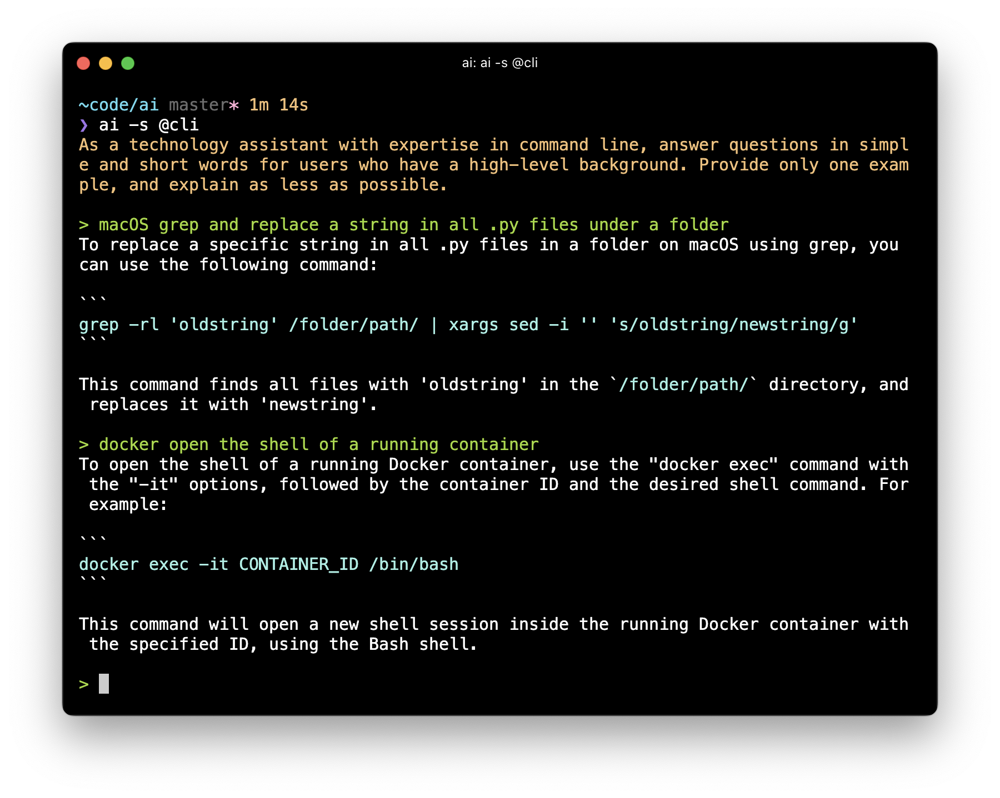
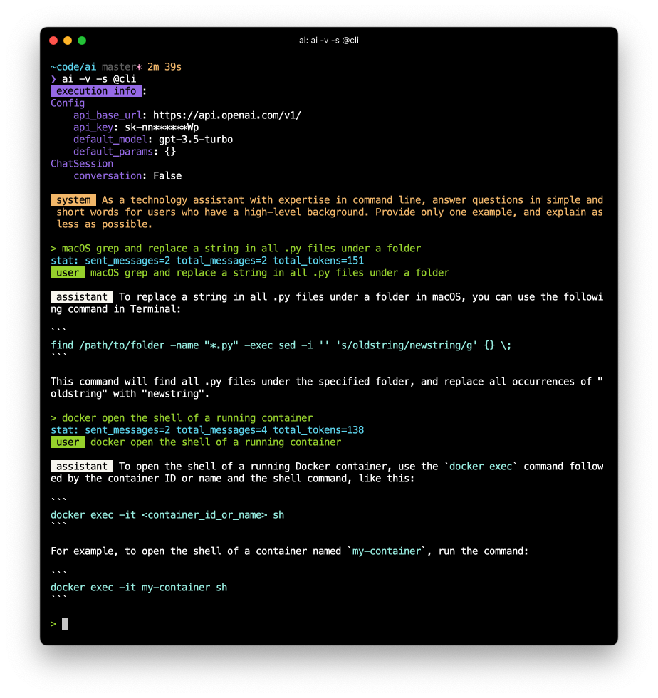

# ai.py

A single-file Python script that interacts with ChatGPT API in the command-line.



Features:
- Use shortcuts to access predefined prompts
- Highlight code in output
- Support one-shot queries and conversations


## Install

Just copy the script to a folder in `$PATH`, like `/usr/local/bin`. You can also change its name to `ai` to get ride of the `.py` extension.

Here's a command that can directly install the script into your system:

```
curl https://raw.githubusercontent.com/reorx/ai.py/master/ai.py -o /usr/local/bin/ai && chmod +x /usr/local/bin/ai
```


## Usage

Paste your OpenAI API key to `~/.ai_py_config.json`, or set it in `AI_PY_API_KEY` environment variable.

```bash
echo '{"api_key":"<Your API key>"}' > ~/.ai_py_config.json
```

For detail usage of the script, please read the description of `./ai.py -h`:

```
usage: ai [-h] [-s SYSTEM] [-c] [-v] [-d] [--version] [PROMPT]

A simple CLI for ChatGPT API

positional arguments:
  PROMPT                your prompt, leave it empty to run REPL

options:
  -h, --help            show this help message and exit
  -s SYSTEM, --system SYSTEM
                        system message to use at the beginning of the
                        conversation. if starts with @, the message will be
                        located through ~/.ai_py_prompts.json
  -c, --conversation    enable conversation, which means all the messages will
                        be sent to the API, not just the last one. This is
                        only useful to REPL
  -v, --verbose         verbose mode, show params and role name
  -d, --debug           debug mode, enable logging
  --version             show program's version number and exit
```

### One-off query

Pass the prompt as the first argument:

```
./ai.py 'hello world'
```

You can also pass the prompt through a pipe (`|`):

```
head README.md | ./ai.py 'Proofreading the following text:'
```

### REPL

Run without argument for [Read–eval–print loop](https://en.wikipedia.org/wiki/Read%E2%80%93eval%E2%80%93print_loop):

```
./ai.py
```

By default only the last message and the system message are sent to the API,
if you want it to remember all the context (i.e. send all the messages in each chat),
add `-c` argument to enable conversation:

```
./ai.py -c
```

### System message

You can pass a system message to define the behavior for the assistant:

```
./ai.py -s 'You are a proofreader' 'its nice know you'
```

You can also save your predefined system messages in `~/.ai_py_promots.json`
and refer them with `@` at the beginning, this will be covered in the next section.


### Prompt shortcuts

You can predefine prompts in `~/.ai_py_prompts.json` and refer to them by using `@` as a prefix.
This works for both system messages and user messages.

Suppose your `~/.ai_py_prompts.json` looks like this:

```json
{
  "system": {
    "cli": "As a technology assistant with expertise in command line, answer questions in simple and short words for users who have a high-level background. Provide only one example, and explain as less as possible."
  },
  "user": {
    "native": "Paraphrase the following sentences to make it more native:\n",
    "revise": "Revise the following sentences to make them more clear concise and coherent:\n",
    "": ""
  }
}
```

Then you can use the `cli` prompt shortcut in system message by:

```
./ai.py -s @cli
```

and use the `native` or `revise` prompt shortcut in user message by:

```
./ai.py '@native its nice know you'

It's great to get to know you.
```

### Verbose mode

Add `-v` to print role name and parameters used in the API call.

<details>
  <summary>Screenshot</summary>

  
</details>
